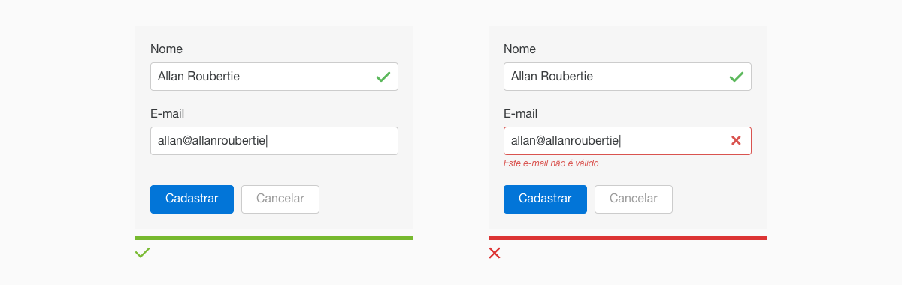
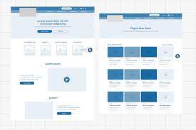
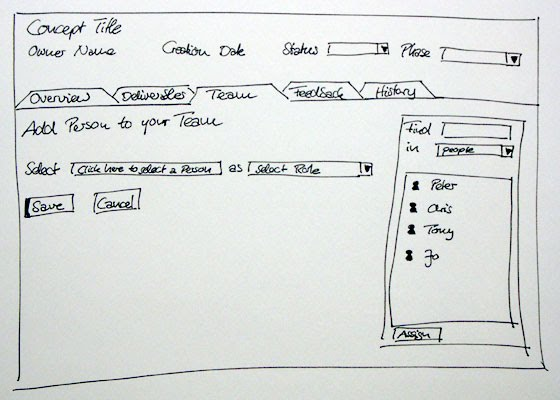

# Documento de Projeto de Software

Desenvolvimento de um sistema << >> 

## Alunos envolvidos

- Aluno 1 - `Líder`
- Aluno 2
- Aluno 3

*Corpo Inicial*

>Introdução
>
>Visão Geral do Projeto
>
>Premissas e Restrições
>
>Visão Geral do Produto
>
>Requisitos Funcionais e Requisitos Não Funcionais
>
>Layout/Prototipagem 

## Introdução

Descreva o propósito da aplicação e o público alvo

## Visão Geral do Projeto

Detalhe com mais precisão o modelo de negócio da aplicação, descreva aspectos como responsividade, objetivos específicos, como vai funcionar cadastro e interação no sistema, além de inovações envolvidas

## Premissas e Restrições

### Atores

Quais os tipos de usuário teremos no sistema

### Regras de Negócios

Descreva o que o sistema deve **permitir no sistema**, exemplo: realizar cadastro, realizar exclusão, interação, chat etc.

## Requisitos Funcionais e Requisitos Não Funcionais

### Requisitos Funcionais

Descreva os requisitos funcionais do sistema, ou seja, a definição do que o sistema fará.

#### Exemplo

|ID| Nome|Descrição|
| :---: | --- | --- |
|RF01|Realizar Cadastro|O sistema deve ser capaz de disponibilizar área para que o usuário realize o cadastro|

### Requisitos Não Funcionais

Descreva os requisitos não funcionais do sistema, ou seja, todas as necessidades que não podem ser atendidas através de funcionalidades.

#### Exemplo

|ID| Nome|Descrição|
| :---: | --- | --- |
|RNF01|Controle de Acesso|O sistema só poderá ser acessado por usuário cadastrado|

## Layout/Prototipagem 

Insira nesta seção as possíveis telas do sistema ou o esboço do sistema, como preferir.

É importante descrever um pouco o fluxo de cada tela.

#### Exemplo 1 

  

#### Exemplo 2 

  

#### Exemplo 3 

  

